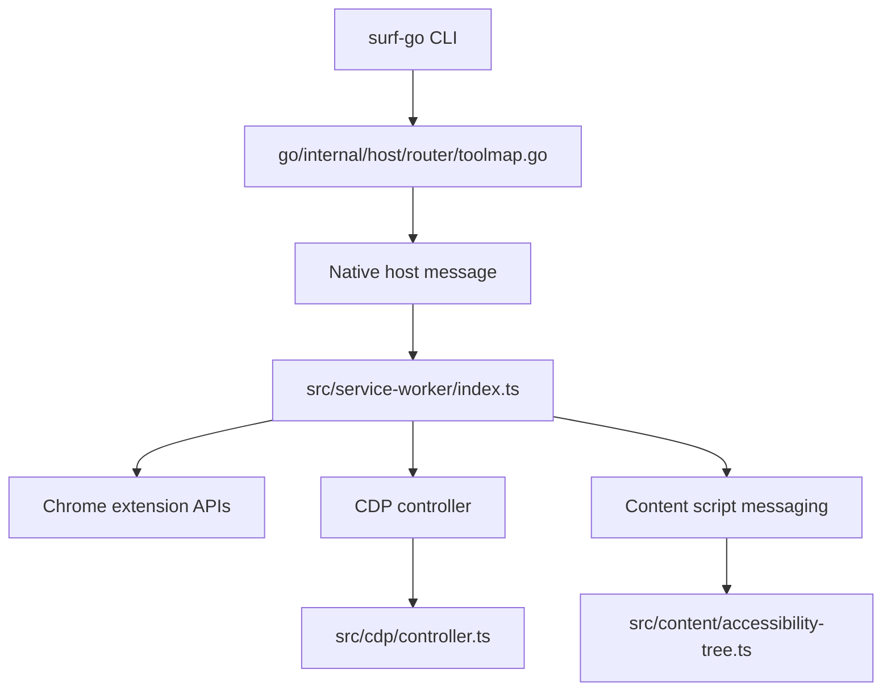

# Frame Discovery and Widget Iframe Targeting Analysis and Implementation Guide

## Executive Summary

Surf currently has two separate frame-targeting systems that only partially overlap. One path uses Chrome extension frame ids from `chrome.webNavigation.getAllFrames`, and the other uses Chrome DevTools Protocol frame ids from `Page.getFrameTree`. For common iframes that is good enough. For Claude artifact widgets and similar embedded applications, it is not. In the live Claude artifact page, the outer DOM clearly exposes a cross-origin widget iframe at `claudemcpcontent.com/mcp_apps?...`, but Surf's current frame plumbing only exposes an empty `about:blank` child frame and a trivial `a.claude.ai/isolated-segment.html?...` frame. The real widget runtime is therefore visible to the user but not reachable by existing Surf commands.

This ticket exists to fix that platform gap. The work is not Claude-specific even though Claude artifacts exposed the problem. The right outcome is to make embedded widget frames discoverable, diagnosable, and targetable across Surf. That includes better frame discovery diagnostics, richer selector-to-frame matching, explicit tracking of both extension-frame ids and CDP frame ids, and on-demand content-script injection or validation for child frames.

This guide is written for an engineer who has not worked on Surf before. It explains the architecture, the failure mode, the relevant files, the APIs involved, and a step-by-step implementation plan. The intent is that a new intern could read this document, reproduce the issue, understand why current behavior fails, and implement the fix in small verifiable steps.

## Problem Statement

### The user-visible failure

In a Claude chat that generated an artifact preview, the user could see a rendered widget iframe and knew there were widget actions such as `download`, `copy`, or `save as artifact`. Surf could not inspect or automate those controls.

The investigation established the following concrete facts:

- The outer Claude page DOM exposes an iframe with a `src` like:
  - `https://<hash>.claudemcpcontent.com/mcp_apps?...`
- The outer Claude page DOM also exposes a second iframe pointing to:
  - `https://a.claude.ai/isolated-segment.html?...`
- `frame.list` shows only:
  - main Claude frame
  - empty `about:blank` child frame
  - `a.claude.ai/isolated-segment.html?...`
  - Intercom
- `frame.js` into the isolated-segment frame only sees a trivial page with `Isolated Segment`
- `frame.js` into the `about:blank` child sees an empty document
- `frame.switch --index 0` followed by content-script-backed commands fails with:
  - `Content script not loaded. Try refreshing the page.`
- Direct page-JS access from `claude.ai` to the `claudemcpcontent.com` iframe fails with a cross-origin `SecurityError`

So the user-visible iframe exists, but Surf does not expose it as a usable execution target.

### Why this matters beyond Claude

This is a general browser automation capability issue.

Any embedded web app or widget can trigger the same class of bug:
- cross-origin preview iframes
- sandboxed widgets
- hosted dashboards inside parent apps
- rich embed surfaces in Gmail, Google Docs, Kagi, Notion, or other SaaS tools

If Surf cannot accurately enumerate and target these frames, future verbs will continue to fail unpredictably.

## Scope

### In scope

- Diagnose the mismatch between:
  - outer DOM iframe inventory
  - Chrome extension frame discovery
  - CDP frame discovery
- Make child/widget frames discoverable in a single diagnostic surface
- Improve frame selection and matching from iframe selectors
- Track enough frame identity to target both:
  - content-script-backed commands
  - CDP frame evaluation
- Reduce or eliminate `Content script not loaded` failures for reachable child frames
- Add validation tooling and documentation so future commands can rely on the improved model

### Out of scope

- Implementing Claude artifact download/export itself in this ticket
- Building new provider verbs on top of the frame fix
- Backward-compatibility adapters unless explicitly requested later

## Current Architecture

### High-level flow

Surf currently routes browser actions through a layered stack.



### Layer 1: Go CLI command surface

Relevant file:
- [main.go](/home/manuel/code/others/llms/pi/nicobailon/surf-cli/go/cmd/surf-go/main.go#L290)

The `surf-go frame` namespace is currently thin. It wires four simple commands:
- `frame list`
- `frame switch`
- `frame main`
- `frame eval`

These map straight through to raw tools. There is no higher-level diagnosis, no dual identity tracking, and no specialized debugging output.

### Layer 2: Go router mapping

Relevant file:
- [toolmap.go](/home/manuel/code/others/llms/pi/nicobailon/surf-cli/go/internal/host/router/toolmap.go#L243)

The router maps:
- `frame.list` -> `GET_FRAMES`
- `frame.switch` -> `FRAME_SWITCH`
- `frame.main` -> `FRAME_MAIN`
- `frame.js` -> `EVALUATE_IN_FRAME`

Important detail:
- `frame.js` uses the arg key `id`, which is forwarded as `frameId`
- The Go CLI does not explain that frame ids here are CDP frame ids, not extension frame ids

This is already a source of confusion.

### Layer 3: Service worker frame routing

Relevant file:
- [index.ts](/home/manuel/code/others/llms/pi/nicobailon/surf-cli/src/service-worker/index.ts#L1700)

The service worker has two different frame paths:

#### `FRAME_SWITCH`

Uses:
- `chrome.webNavigation.getAllFrames({ tabId })`

Then:
- filters child frames (`frameId !== 0`)
- can choose by `index`, `name`, or `selector`
- for `selector`, it asks the main content script for iframe metadata via `GET_FRAME_BY_SELECTOR`
- matches by URL or uses a single-frame fallback
- stores the selected extension frame id in `frameContexts`

#### `EVALUATE_IN_FRAME`

Uses:
- `cdp.evaluateInFrame(tabId, message.frameId, message.code)`

This path takes a CDP frame id, not the extension frame id stored in `frameContexts`.

#### Implication

Surf talks about “the current frame” as if it were one concept, but in reality it has:
- extension frame ids for content-script messaging
- CDP frame ids for in-frame evaluation

Those ids are not interchangeable.

### Layer 4: CDP frame discovery and evaluation

Relevant file:
- [controller.ts](/home/manuel/code/others/llms/pi/nicobailon/surf-cli/src/cdp/controller.ts#L903)

`getFrames`:
- calls `Page.getFrameTree`
- recursively extracts frames
- returns `frameId`, `url`, `name`, and `parentId`

`evaluateInFrame`:
- calls `Page.createIsolatedWorld(frameId, worldName)`
- evaluates code with `Runtime.evaluate`
- wraps the expression as:
  - `JSON.stringify((function() { ... })())`

This is a CDP-only path. It cannot help if the relevant widget runtime does not appear as a meaningful CDP frame.

### Layer 5: Content script side

Relevant file:
- [accessibility-tree.ts](/home/manuel/code/others/llms/pi/nicobailon/surf-cli/src/content/accessibility-tree.ts#L1484)

The content script handles:
- `GET_FRAME_BY_SELECTOR`
- `GET_FRAME_NAME`
- many DOM automation commands

`GET_FRAME_BY_SELECTOR` currently returns only:
- `url: iframe.src`
- `name: iframe.name`

That is too little information for robust frame correlation.

## Current Failure Mode Explained

### What we observed

From the outer Claude page, a page-JS probe reported:
- iframe 0: `claudemcpcontent.com/mcp_apps?...`
- iframe 1: `a.claude.ai/isolated-segment.html?...`

But `frame.list` returned only:
- main frame
- empty `about:blank` child
- isolated-segment child
- Intercom

### Why this is bad

It means Surf has no reliable way to target the widget iframe the user can visibly see.

### Probable causes

There are a few plausible mechanisms:

1. Chrome frame discovery may expose the widget shell as a transitional `about:blank` frame while the visible iframe `src` already points at the widget URL.
2. CDP may expose only the inner isolated-segment child as a distinct execution frame.
3. The widget may depend on nested messaging/bootstrap logic such that the parent visible iframe URL is not itself the actual script-execution context available to Surf.
4. Content scripts may not be injected into that child frame at all, even when `webNavigation` knows it exists.

### The real issue

The important point is not which of those subcauses dominates. The real issue is that Surf lacks a unified frame identity model and lacks diagnostics that compare the three sources of truth:
- DOM iframe elements
- extension frame ids
- CDP frame ids

Without that, developers cannot tell whether a frame is:
- visible but undiscoverable
- discoverable but not injectable
- injectable but not CDP-addressable
- CDP-addressable but not content-script-addressable

## Design Goals

1. Make frame state visible and debuggable.
2. Distinguish extension frame ids from CDP frame ids explicitly.
3. Improve selector-based targeting for iframe elements.
4. Provide on-demand checks for content-script presence in a child frame.
5. Keep the result general, not Claude-specific.

## Proposed Solution

The proposed solution has four parts.

### Part A: Add a first-class frame diagnosis surface

Add a new command family, likely under `surf-go frame`, such as:
- `surf-go frame diagnose`

It should gather and present, for one tab:
- outer DOM iframe inventory from the main page
- extension frame inventory from `chrome.webNavigation.getAllFrames`
- CDP frame inventory from `Page.getFrameTree`
- content-script reachability per extension frame id

This diagnostic command should become the standard debugging tool for all future iframe/widget issues.

#### Suggested output schema

```yaml
mainPage:
  href: https://claude.ai/chat/...
  title: Art of insight landing page - Claude
  domIframes:
    - domIndex: 0
      src: https://...claudemcpcontent.com/mcp_apps?... 
      title: Art of insight landing page
      sandbox: allow-scripts allow-same-origin allow-forms
    - domIndex: 1
      src: https://a.claude.ai/isolated-segment.html?v=...
      title: Marketing analytics
extensionFrames:
  - extensionFrameId: 0
    url: https://claude.ai/chat/...
  - extensionFrameId: 65
    url: about:blank
    contentScriptReachable: false
  - extensionFrameId: 71
    url: https://a.claude.ai/isolated-segment.html?v=...
    contentScriptReachable: true
cdpFrames:
  - cdpFrameId: 06A6...
    url: https://claude.ai/chat/...
  - cdpFrameId: 3DB0...
    url: about:blank
  - cdpFrameId: B94C...
    url: https://a.claude.ai/isolated-segment.html?v=...
correlations:
  - domIndex: 0
    suspectedExtensionFrameId: 65
    suspectedCdpFrameId: null
    notes:
      - visible in DOM
      - not surfaced as meaningful CDP frame
      - content script unavailable
```

### Part B: Enrich iframe selector metadata

Expand `GET_FRAME_BY_SELECTOR` so it returns more than `src` and `name`.

Suggested response shape:

```ts
{
  url: string;
  name?: string;
  title?: string;
  domIndex: number;
  rect?: { x: number; y: number; width: number; height: number };
  sandbox?: string;
  allow?: string;
}
```

This gives the service worker more data to match against `webNavigation` and CDP inventories.

### Part C: Represent both frame-id types explicitly

Instead of pretending there is one “selected frame”, Surf should internally represent:

```ts
interface ResolvedFrameTarget {
  extensionFrameId?: number;
  cdpFrameId?: string;
  url?: string;
  title?: string;
  domIndex?: number;
  source: "selector" | "name" | "index" | "diagnostic-correlation";
}
```

Then:
- `page.read`, `click`, `locate.*`, `form_input`, etc. use `extensionFrameId`
- `frame.js` uses `cdpFrameId`

If only one id type exists, commands that require the missing id type should fail explicitly rather than silently targeting the wrong context.

### Part D: Make content-script reachability explicit and recoverable

When a selected child frame does not have the content script loaded, Surf should not only say “refresh the page”. It should:
- report the exact frame id and URL
- attempt on-demand injection if feasible
- or clearly mark the frame as non-injectable

Suggested helper in the service worker:

```ts
async function ensureContentScriptInFrame(tabId: number, frameId: number): Promise<{
  ok: boolean;
  reason?: string;
}> {
  try {
    await chrome.tabs.sendMessage(tabId, { type: "PING" }, { frameId });
    return { ok: true };
  } catch (err) {
    // Optional: try chrome.scripting.executeScript here if permissions allow.
    return { ok: false, reason: String(err) };
  }
}
```

If dynamic injection is feasible in this extension architecture, use it. If not, at least surface the reason clearly in diagnostics.

## Proposed APIs and Command Shape

### New service-worker message

Add a new message type such as:
- `FRAME_DIAGNOSE`

Pseudo-contract:

```ts
{
  type: "FRAME_DIAGNOSE";
  tabId: number;
}
```

Response:

```ts
{
  success: boolean;
  mainPage: {...};
  domIframes: [...];
  extensionFrames: [...];
  cdpFrames: [...];
  correlations: [...];
  warnings: string[];
}
```

### Go router mapping

Add:
- `frame.diagnose` -> `FRAME_DIAGNOSE`

### Go CLI

Add under `surf-go frame`:
- `diagnose`

This should be a Glazed command, not just a raw passthrough, because it is a debugging artifact with structured output and likely benefits from dual-mode rendering.

## Implementation Plan

### Phase 1: Diagnostics first

Goal:
- see all frame sources in one place before changing matching logic

Work:
- add `FRAME_DIAGNOSE` in the service worker
- add DOM iframe inventory collection in main page context
- collect `webNavigation` frames and CDP frames together
- probe content-script reachability per extension frame
- expose `surf-go frame diagnose`

Validation:
- run on the Claude artifact tab
- confirm it clearly shows the mismatch

### Phase 2: Enrich selector-based targeting

Goal:
- make `frame.switch --selector` match widget frames more robustly

Work:
- extend `GET_FRAME_BY_SELECTOR`
- return title/domIndex/rect/sandbox/allow
- update service-worker frame matching to use richer heuristics

Validation:
- selector-based switch on `iframe[title="Art of insight landing page"]`
- confirm selected target is the right extension frame

### Phase 3: Make frame identity explicit

Goal:
- stop conflating extension frame ids and CDP frame ids

Work:
- add a resolved-frame structure in service worker state
- update `frameContexts` storage or replace it
- make command routing explicit about which id type each tool needs

Validation:
- selected frame can be used correctly for both content-script and CDP-aware operations when available

### Phase 4: Improve content-script reachability

Goal:
- reduce `Content script not loaded` dead ends

Work:
- add reachability checks
- optionally add dynamic injection if supported
- improve errors and diagnostics when injection is impossible

Validation:
- selected child frame either works or reports exactly why not

## Pseudocode

### Diagnostic collector

```ts
async function diagnoseFrames(tabId: number) {
  const domIframes = await cdp.evaluateScript(tabId, `JSON.stringify(Array.from(document.querySelectorAll('iframe')).map((el, i) => ({
    domIndex: i,
    src: el.src,
    title: el.title,
    sandbox: el.getAttribute('sandbox') || '',
    allow: el.getAttribute('allow') || ''
  })))`);

  const extensionFrames = await chrome.webNavigation.getAllFrames({ tabId });
  const cdpFrames = await cdp.getFrames(tabId);

  const extensionReachability = [];
  for (const f of extensionFrames) {
    if (f.frameId === 0) continue;
    try {
      await chrome.tabs.sendMessage(tabId, { type: 'PING' }, { frameId: f.frameId });
      extensionReachability.push({ frameId: f.frameId, reachable: true });
    } catch (err) {
      extensionReachability.push({ frameId: f.frameId, reachable: false, error: String(err) });
    }
  }

  return correlate(domIframes, extensionFrames, cdpFrames, extensionReachability);
}
```

### Richer selector-based resolution

```ts
async function resolveFrameBySelector(tabId: number, selector: string): Promise<ResolvedFrameTarget> {
  const domInfo = await sendToMainFrame(tabId, { type: 'GET_FRAME_BY_SELECTOR', selector });
  const extensionFrames = await chrome.webNavigation.getAllFrames({ tabId });
  const cdpFrames = await cdp.getFrames(tabId);

  const extMatch = matchExtensionFrame(domInfo, extensionFrames);
  const cdpMatch = matchCdpFrame(domInfo, cdpFrames);

  return {
    extensionFrameId: extMatch?.frameId,
    cdpFrameId: cdpMatch?.frameId,
    url: domInfo.url,
    title: domInfo.title,
    domIndex: domInfo.domIndex,
    source: 'selector',
  };
}
```

## Risks and Sharp Edges

### Risk 1: cross-origin assumptions

The outer page cannot read cross-origin iframe DOM directly. Any implementation that depends on `iframe.contentDocument` from the parent page will fail in the general case.

### Risk 2: dynamic iframe bootstrapping

The visible `src` attribute may not map cleanly to the actual execution context that CDP or `webNavigation` exposes.

### Risk 3: content-script permissions

Even if frame discovery is fixed, content scripts may still be unavailable in some child frames because of manifest, permissions, or timing constraints.

### Risk 4: hidden id coupling

If the service worker stores only one frame id type, later commands may silently mix CDP ids and extension ids again.

## Alternatives Considered

### Alternative A: Claude-specific workaround

Example:
- special-case Claude artifact iframes and probe them with a bespoke command

Why not:
- fixes only one provider
- hides the platform gap
- likely fails for the next iframe-heavy app

### Alternative B: only improve selector matching

Why not:
- selector matching alone does not help if content scripts cannot execute in the selected frame
- it also does not help CDP if the frame tree is incomplete

### Alternative C: only use CDP

Why not:
- many existing Surf commands are content-script-backed
- CDP alone cannot replace that without a much larger rewrite

## Testing and Validation Strategy

### Unit-level

- service-worker frame correlation helpers
- selector matching heuristics
- resolved-frame identity structures

### Integration-level

- router mapping for `frame.diagnose`
- `surf-go frame diagnose` output shape
- no regression for existing `frame list`, `frame switch`, `frame eval`

### Real-browser validation

Target pages:
- Claude artifact chat
- at least one non-Claude cross-origin widget or embed if available

Expected checks:
1. `frame diagnose` shows DOM iframe inventory and frame mismatches clearly
2. `frame switch --selector` resolves the intended widget frame
3. content-script-backed command either works in that frame or reports a precise cause
4. `frame eval` can target the correct CDP frame when available

## Suggested Task Breakdown

1. Create `frame diagnose` plumbing in router, service worker, and CLI.
2. Add DOM iframe inventory collection in the service worker.
3. Add extension-frame reachability probing.
4. Add richer `GET_FRAME_BY_SELECTOR` metadata.
5. Implement correlation helpers and output schema.
6. Replace raw `frameContexts` integer storage with an explicit resolved-target structure.
7. Improve content-script error handling and optional injection path.
8. Validate on Claude artifact widget.
9. Update help docs and diary.

## File References

Core files to understand before coding:
- [main.go](/home/manuel/code/others/llms/pi/nicobailon/surf-cli/go/cmd/surf-go/main.go#L290)
- [toolmap.go](/home/manuel/code/others/llms/pi/nicobailon/surf-cli/go/internal/host/router/toolmap.go#L243)
- [index.ts](/home/manuel/code/others/llms/pi/nicobailon/surf-cli/src/service-worker/index.ts#L1700)
- [controller.ts](/home/manuel/code/others/llms/pi/nicobailon/surf-cli/src/cdp/controller.ts#L903)
- [accessibility-tree.ts](/home/manuel/code/others/llms/pi/nicobailon/surf-cli/src/content/accessibility-tree.ts#L1484)
- [R7 diary](/home/manuel/code/others/llms/pi/nicobailon/surf-cli/ttmp/2026/04/10/SURF-20260410-R7--claude-provider-commands/reference/01-investigation-diary.md)

## Recommendation

Start with diagnostics, not behavior changes.

The temptation is to jump straight into fixing `frame.switch`, but that will produce another round of guesswork. First build the diagnostic surface that lets us see the mismatch. Once that exists, the selector-matching and injection work becomes evidence-based and much safer.
